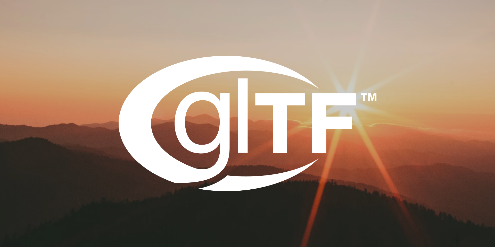

# gltf - glTF library and viewer for Nim.

`nimby install gltf`


[API reference](https://treeform.github.io/gltf)

## About

`gltf` is a small glTF 2.0 toolkit for Nim. It can load `.gltf` and
`.glb` files into a `Node` tree, render that tree with a small OpenGL PBR
pipeline, write simple scenes back out as `.glb`, and read or write basic
KTX2 textures for OpenGL workflows.

The project is still growing, but it is already useful for:

- Loading glTF models in Nim code.
- Inspecting models with a local viewer.
- Rendering models with a simple PBR path.
- Exporting simple scenes back to binary glTF.

### Documentation

- API reference: [treeform.github.io/gltf](https://treeform.github.io/gltf)
- Source entry point: `src/gltf.nim`
- Example program: `examples/load_model.nim`
- Viewer tool: `tools/gltf_viewer.nim`

## Installation

Install the package with:

```sh
nimby install gltf
```

The package depends on:

- `vmath`
- `chroma`
- `pixie`
- `flatty`
- `opengl`
- `webby`
- `windy`
- `silky`

## Support

The table below reflects the current code, not the full glTF 2.0 spec.

| Feature | Read | Render | Write | Notes |
| --- | --- | --- | --- | --- |
| `.gltf` JSON files | Yes | n/a | No | Reads external buffers and data URIs. |
| `.glb` binary files | Yes | n/a | Yes | `writeGLB` writes binary glTF 2.0. |
| Scenes and node hierarchies | Yes | Yes | Yes | Preserves names, children, and TRS transforms. |
| Primitive modes | Yes | Yes | Yes | Points, lines, strips, fans, and triangles are read and rendered. |
| Positions | Yes | Yes | Yes | `POSITION` is supported. |
| Normals | Yes | Yes | Yes | `NORMAL` is supported. |
| Tangents | Yes | Yes | No | Reads authored tangents and falls back to generated tangents when missing. |
| UV set 0 | Yes | Yes | Yes | `TEXCOORD_0` is supported. |
| UV set 1 | Yes | Yes | No | `TEXCOORD_1` is loaded and used by texture inputs with `texCoord: 1`. |
| Vertex colors | Yes | Yes | Yes | `COLOR_0` is supported. |
| Indices | Yes | Yes | Yes | Reads `uint8`, `uint16`, and `uint32`. Writes `uint8`, `uint16`, and `uint32`. |
| PBR base color | Yes | Yes | Yes | Reads texture and factor. Writes texture and factor. |
| Metallic and roughness factors | Yes | Yes | Yes | Scalar factors are read and written. |
| Metallic-roughness texture | Yes | Yes | No | Loaded and rendered, not exported yet. |
| Normal texture | Yes | Yes | No | Loaded and rendered, not exported yet. |
| Occlusion texture | Yes | Yes | No | Loaded and rendered, not exported yet. |
| Emissive texture and factor | Yes | Yes | No | Loaded and rendered, not exported yet. |
| Alpha modes | Yes | Yes | Yes | `OPAQUE`, `MASK`, and `BLEND` are supported. |
| Double-sided materials | Yes | Yes | Yes | Read and written. |
| PNG and JPEG images | Yes | Yes | Partial | Reader supports file URIs, data URIs, and buffer views. Writer embeds PNG data in GLB. |
| Sparse accessors | Partial | Partial | No | Scalar, `VEC2`, `VEC3`, `VEC4`, and quaternion paths are supported. Sparse `MAT4` is not handled yet. |
| Animations | Partial | Partial | No | Translation, rotation, scale, and morph weight channels support `STEP`, `LINEAR`, and `CUBICSPLINE`. |
| Skins | Yes | Yes | No | `JOINTS_0` and `WEIGHTS_0` are supported with GPU skinning. |
| Morph targets | Yes | Yes | No | Position, normal, and tangent targets are applied at runtime. |
| Cameras | Yes | Yes | No | Perspective and orthographic cameras are loaded from glTF. |
| `KHR_texture_transform` | Yes | Yes | No | Texture transforms and `texCoord` overrides are supported. |
| `KHR_materials_transmission` | Partial | Partial | No | Transmission factors are read and rendered, but broader extension coverage is incomplete. |
| `KHR_node_visibility` | Yes | Yes | No | Static visibility and visibility animation are supported. |
| `KHR_animation_pointer` | Partial | Partial | No | Only the visibility target path is supported. |
| `KHR_draco_mesh_compression` | No | No | No | Not supported yet. |
| `KHR_mesh_quantization` | No | No | No | Not supported yet. |
| `KHR_texture_basisu` | Yes | Yes | Partial | KTX2 textures; see [KHR_texture_basisu and KTX2](#khr_texture_basisu-and-ktx2). The embedded KTX2 module can read and write supported KTX2 payloads directly, while glTF export paths that generate new encoded sidecars still use [KTX-Software](#writing-ktx2-with-ktx-software). |
| `KHR_lights_punctual` | No | No | No | Not supported yet. |
| `KHR_materials_unlit` | No | No | No | Not supported yet. |
| `EXT_texture_webp` | No | No | No | Not supported yet. |

## KHR_texture_basisu and KTX2

The library declares support for the glTF extension **`KHR_texture_basisu`**, which lets materials reference **KTX 2.0** (`.ktx2`) images instead of PNG or JPEG. That path is aimed at **runtime performance** (smaller on-disk size and direct compressed uploads to the GPU), not at general authoring workflows.

### Extension

- Textures can use `extensions.KHR_texture_basisu.source` to point at an image that carries KTX2 payload (`mimeType: image/ktx2`), including sidecar `.ktx2` URIs, `data:image/ktx2` data URIs, and buffer views with `mimeType: image/ktx2`.

### Embedded KTX2 reader/writer

The embedded KTX2 code can load supported files into **OpenGL 2D textures** and can also write supported textures back out from live OpenGL texture objects. Supported inputs and outputs match what the code accepts today:

| Aspect | Supported |
| --- | --- |
| Container | **KTX 2.0** (identifier `KTX 20`) |
| Supercompression | **None** only (`supercompressionScheme == 0`). Basis, LZ4, Zstandard, etc. are rejected. |
| Shape | **2D** textures: width and height &gt; 0; `depth` 0 or 1; **single** layer (`layerCount` 0 or 1); **one** face (not cubemaps). |
| Mipmaps | At least **one** mip level; full mip chains are uploaded. |
| Block formats | **BC1–BC5** only (Vulkan block formats `VK_FORMAT_BC1_*` … `VK_FORMAT_BC5_*`), i.e. DXT1/3/5 and BC4/5-style compressed data as exposed by OpenGL’s `GL_COMPRESSED_*` enums. |

Anything outside that (3D/volume KTX2, texture arrays beyond a single layer, cubemaps, supercompressed payloads, or other `vkFormat` values) is not supported and will fail with a clear error.

### Supported KTX2 writing

- `writeKtx2TextureFile()` writes **2D** textures directly from a live OpenGL texture object.
- Uncompressed writes include `VK_FORMAT_R32_SFLOAT`.
- Compressed writes include **BC1-BC5** when OpenGL can provide or create those compressed levels.
- The low-level KTX2 module itself does **not** require `ktx.exe` for these direct texture writes.

### Writing KTX2 with KTX Software

Exporting glTF that uses **`KHR_texture_basisu`** and external `.ktx2` sidecars still does **not** fully reimplement the higher-level image encoding pipeline inside Nim. That glTF export path shells out to the official **[KTX-Software](https://github.com/KhronosGroup/KTX-Software)** command-line tool: the **`ktx`** executable must be on **`PATH`** (see `findExe("ktx")` in the writer). If it is missing, writing those encoded KTX2 sidecars raises an error explaining that requirement.

That pipeline is **for optimization and shipping builds**, not something most users should hand-roll as their default content workflow. Typical authoring still uses PNG or JPEG; you then convert to KTX2 when you care about **load time and size** in a game or similar runtime. As a **developer** of this library or of tools built on it, you will usually want KTX-Software installed so tests and `writeGLB` paths that emit KTX2 can run locally and in CI.

**Why use KTX2 at all?** The practical reason in this context is **faster loads and smaller packages for texture-heavy games**: GPU-native block formats avoid decoding PNG/JPEG at runtime and map cleanly to compressed texture uploads.

## Usage

For simple loading:

```nim
import gltf

let gltfFile = readGltfFile("model.glb")
let root = gltfFile.root

echo root.name
echo root.walkNodes().len
echo root.getBoundingSphere().radius
```

Useful helpers on `Node` include:

- `walkNodes()`
- `getAABounds()`
- `getBoundingSphere()`
- `updateAnimation()`
- `dumpTree()`

To write a simple scene back to binary glTF:

```nim
import gltf

writeGLB(root, "out.glb")
```

## Examples

The repository includes a small example loader:

```sh
nim r examples/load_model.nim path/to/model.glb
```

It uses `readGltfFile()` and prints:

- The source file path.
- The root node name.
- The root child count.

This is the simplest way to verify that loading works.

## Viewer

The interactive viewer lives in `tools/gltf_viewer.nim`:

```sh
nim r tools/gltf_viewer.nim path/to/model.glb
```

It sets up the PBR renderer, loads the file, prints the node tree,
computes bounds, and opens a window for inspection.

Current controls:

- Middle mouse drag, or Command plus left drag, orbit the camera.
- Mouse wheel dollies in and out.
- `3` toggles light follow camera.
- `4` sets the light to the current camera position.

## Project Layout

- `src/` contains the library modules.
- `examples/` contains small runnable examples.
- `tools/` contains helper programs such as the viewer.
- `tests/` contains simple `doAssert` based tests.
- `experiments/` contains rendering experiments and shader work.

## Development

The project includes standard build and docs workflows:

- `.github/workflows/build.yml`
- `.github/workflows/docs.yml`

Run the checks locally with:

```sh
nim check src/gltf.nim
nim r tests/tests.nim
```

## License

This project uses the MIT license. See `LICENSE`.
